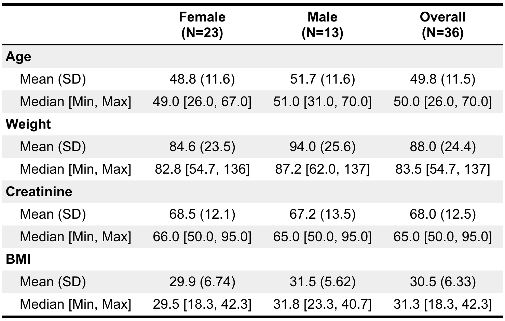
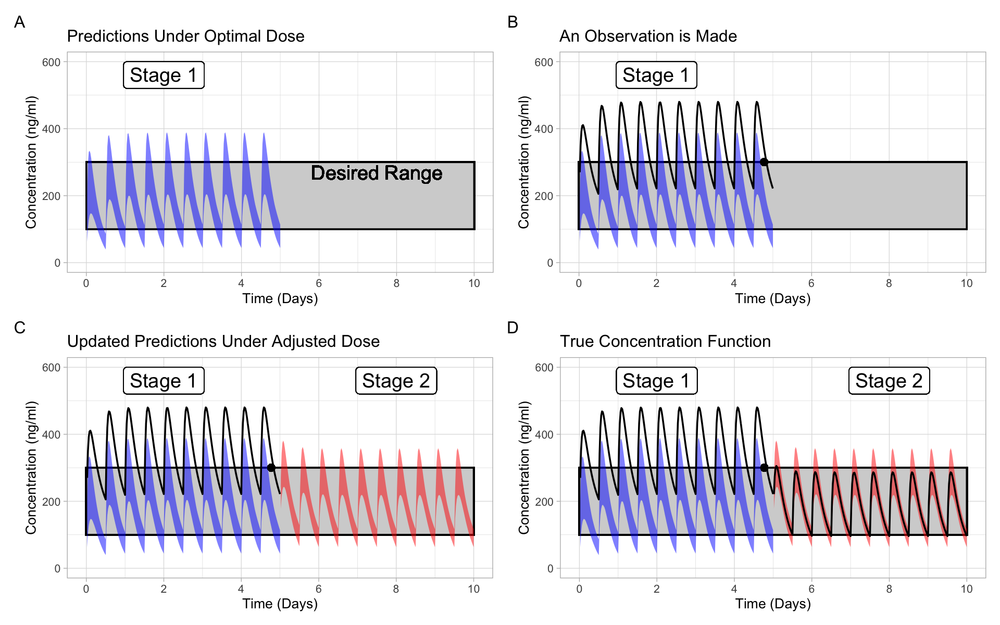

```{r setup, include=FALSE}
knitr::opts_chunk$set(echo = FALSE)
```


### Motivation

* Different people react differently to the same drug. 

* Obstacle for optimal treatment:

  * Heightened response ($\to$ toxicity)
  * Lowered response ($\to$ inefficacy)
  
* Personalized medicine is a response to this problem.

### Personalized Medicine

*Personalized Medicine (PM)*: Application of genomic, demographic, and lifestyle factors as predictors of disease risk and individualization of drug therapy [@morse2015personalized].

Morse and Kim identify 4 goals of PM:

  1) Which drugs have excess variation?
  2) **Which factors drive variation?**
  3) **Personalize dose**
  4) Prevent adverse events

### Excess Variation Motivates Fine Tuning

* *Pharmacokinetics* (PK): Time course of drug concentrations in the body. 
  * Understand variation in concentration since drug concentration $\leftrightarrow$ drug exposure.
* Many PK studies provide dose adjustment criteria
* Still excess variation in response [@sukumar2019apixaban].  
* "Fine tune" to population at hand.

### How to "Fine Tune"

* Bayesian statistics
* Formalize sequential decision making with Dynamic Treatment Regimes (DTRs)
* Decisions in PM are based on concentrations (PK).  Synergy between PK modelling and DTRs.

### This Thesis

* Methods for creating Bayesian PK models for:
  * Inference on covariate effects on concentrations, and
  * Use in optimal sequential decision making on dose size.
  
Hence, this thesis is most closely aligned with goals \textcolor{uwo-purple}{(2) and (3)} of personalized medicine.

### Objectives & Contributions

* Compare/contrast existing approaches to fitting Bayesian models
  * Simulation study on decision quality.
* Framework for "is the juice worth the squeeze".
  * Simulation-based evaluation of personalization based on PK combined with DTRs.
* Demonstrate how PM researchers in academic centers can use all data available to them.
  * Demonstration how to combine different types of data with comments on how to maintain exchangeability.

## Paper 1: Comparisons Between HMC and MAP for a Bayesian Model for Apixiban Induction Dose and Dose Personalization

### Background

* Hamiltonian Monte Carlo (HMC) considered gold standard.
* Prior to that, Maximum A Posteriori (MAP) a popular method.
* Recently, theoretical arguments *against* using in some models.
* Question:
  * Are decisions in PM greatly affected by choice of inference method?
  * Answer: Predictions of concentration are similar, but uncertainty is different.  This affects decision quality.
  
### Motivating Theory

* Intuition for MAP starts in low dimensions
* Theory: "As dimensionality $\uparrow$, MAP is poorer approximation".
* For some PK models, number parameters $\propto 3 \times  \text{Number of subjects}$.

### Experiments

* Need a ground truth that looks similar to real data.
* Fit a model using HMC to real data and use posterior predictive to generate 100 new simulated patients.
* Refit the model on this simulated data, this time with MAP and HMC. 
* Compare decision quality based on two criteria:
  * Pick a dose so the maximum concentration is not too large (toxicity)
  * Pick a dose so the trough concentration is not too small (inefficacy)


### The (Real) Data



### The Model

* 1 Compartment PK model with first order elimination and absorption.
* Prior distributions derived from a 2019 review on apixaban pharmacokinetics.
* Each patient gets their own parameters through a random effect
$$C(t)= \begin{cases}\frac{F \cdot D}{C l} \frac{k_e \cdot k_a}{k_e-k_a}\left(e^{-k_a(t-\delta)}-e^{-k_e(t-\delta)}\right) & \delta \leq t \\ 0 & \text { else }\end{cases}$$$$ \log(Cl_j) \sim \mathcal{N}(\beta_{0, Cl}, \sigma^2_{Cl}) $$$$ \log(t_{\max, j}) \sim \mathcal{N}(\beta_{0, t_{\max}}, \sigma^2_{t_{\max}}) $$$$ \operatorname{logit}(\alpha_j) \sim \mathcal{N}(\beta_{0, \alpha}, \sigma^2_\alpha) $$$$ \delta_j \sim \operatorname{Beta}(\mu \kappa \>, (1-\mu) \kappa) $$

### The Model
<center>

{height=80%}

</center>

### Modelling Results 

![[Left] Draws from the prior distribution.  [Center] Two patients from our dataset. [Right] Posterior fits for the latent concentration.](../figures/fig3.png)


### Checking Decision Quality

* Prediction Error
* Decisions under uncertainty
  * Pick a time, $T$ (e.g. $t_{\max}$)
  * Pick a threshold, $c$
  * Pick a desired risk level, $R$.
  * Select a dose so that $P\Big(C(T) > c\Big) = R$

### Checking Decision Quality

* Approximately $R\times 100$ patients should exceed the threshold.
* Check the calibration of dosing decisions using models fit by MAP and HMC.

### Prediction Error Very Similar

* Prediction error is very similar, no reason to prefer one over the other.

```{r, echo=F, message=F, warning=F}
library(tidyverse)
library(kableExtra)

tribble(
  ~"Loss", ~'HMC', ~"MAP",
  "MSE (Sd)", "6.67 (15.93)", "8.57 (19.93)",
  "MAE (Sd)", "1.71 (1.94)", "1.97 (2.17)",
  "MAPE (Sd)",  "0.04 (0.03)", "0.05 (0.03)"
) %>% 
  kbl(format = 'latex') %>% 
  kable_styling(bootstrap_options = 'striped')
```

### Calibration is Very Different

* HMC very well calibrated, MAP not so much.
* Remember, same model and same priors. Different decisions.
* Why is this happening?

![Calibration on decisions. [Left] Calibration for decision on max concentration.  [Right] Calibration on trough concentration.](../figures/fig8.png){width=80%}

### Uncertainty is Larger in MAP Model

* MAP results in excess uncertainty as compared to HMC.
* Because decisions integrate over uncertainty, differences in uncertainty $\to$ differences in decisions.

{width=95%}

### Discussion

* MAP leads to different decisions than HMC.
  * Affect on decisions depends on the loss.
* MAP is fast and familiar to MLE, but it is not interchangeable with HMC for these types of models.
* Recommend that if you are to use MAP, invest the time to compare against HMC.

## Paper 2: Developing and Evaulating Pharmacokinetics-Driven Dynamic Personalized Medicine: A Framework and Case Study

### Background

* Many studies regress stable dose onto pre-dose covariates (*static personalization*).

* Need for dose titration has been reduced, but not eliminated.

* Personalize the titration process too for optimal decision making (*dynamic personalization*).

* Is the juice of dynamic personalization worth the squeeze?
  * Are the possible gains from dynamic personalization worth imposing additional burden onto patients?
  
### Why Is This Important?

* Circumstances for cost effectiveness of PM are unclear [@looff2016economic],[@shabaruddin2015economic].
* Additional variability in QALY for some modes of PM [@kasztura2019cost]. Question if burden is worth payoff.
* Need for PM to focus on needs, constraints, and utilities of patients [@rogowski2015concepts],[@di2017personalized].    
* E.g. Frequent followup
* Incorporating patient preferences $\to$ sustained adherence [@elliott2008understanding].

* Framework we present produces some evidence for effectiveness of a range of modes of PM to inform organization-level decisions surrounding implementation.

### Related Work

* Other studies which apply Q-learning.
* Most closest is Rich et. al [@rich2014simulating], who develop a SMART trial for optimal dose selection using pharmacokinetic data.
* Main differences:
  * Other studies often *estimate* the value function. 
  * Our value function based on PK model. 
  * Question now is "Is the value function based on PK the function we really want?"


### Framework

Various Steps in the Framework:

 1. Have a PK model for a given drug, fit it on real data.
 
 2. Use the model to simulate new patients (much like before).
 
 3. Try different forms of personalization on these simulated subjects.
 
 4. Because we know the truth, determine the "return" from each form of personalization.


### Step 1. Model  & Step 2. Simulate

* Similar to last model, but now adjust for patient covariates and allow for multiple doses.

$$C(t)= \begin{cases}\frac{F \cdot D}{C l} \frac{k_e \cdot k_a}{k_e-k_a}\left(e^{-k_a(t-\delta)}-e^{-k_e(t-\delta)}\right) & \delta \leq t \\ 0 & \text { else }\end{cases}$$
$$y(t) = \sum_{j=0} ^ {20} C(t-12j)H(t-12j)$$

$$ \log(Cl_j) \sim \mathcal{N}\Big(\beta^{Cl}_{0, j} + \mathbf{x}^{Cl}_j \beta_{Cl}\>, \sigma^2_{Cl}\Big)$$
$$ \log(t_{\max, j}) \sim \mathcal{N}\Big(\beta^{t_{\max}}_{0, j} + \mathbf{x}^{t_{\max}}_j \beta_{t_{\max}} \>, \sigma^2_{t_{\max}} \Big)$$
$$ \operatorname{logit}(\alpha_j) \sim \mathcal{N}\Big(\beta^{\alpha}_{0, j} + \mathbf{x}^{\alpha}_j \beta_{\alpha} \>, \sigma^2_{\alpha} \Big)$$

### The Model 

{height=80%}


### Step 3. Forms of Personalization

* Goal: Keep patients within some concentration range
* Not intended to be exhaustive, just demonstrative of capabilities:
  * "One Size Fits All" dose
  * "One Size Fits All" dose + 1 dose adjustment (based on measurement of concentration)
  * Dose based on clinical variables
  * Dose based on clinical variables + 1 dose adjustment
  * Optimal Sampling Time (via Q Learning)
  * Optimal Sequential Dosing (via Q Learning)
  
### Step 4: Determination of the Return



### Results

* Modes of personalization which use more information result in lower regret
* Point of diminishing returns
* Would expect Q-learning to perform better when elimination rates were very low, meaning impact of decisions last longer.


### Conclusions

TBD

## Paper 3: Pooling Pharmacokinetic Information Using Hierarchical Models

### Introduction

* Personalized dosing is a goal of PM.
* Sample size limitation for independent researchers
* Models from RCTs may lack external validity
* How can investigators use *all* data available for:
  * Discovery
  * Inference
* In this work, pool data from *different* types of studies
* Plus, simulation study to show how sparisty inducing priors can be used for discovery
  
### Background: Discovery

* "Which variables should be in the model?".
* Existing studies us variable selection.  Known deficiencies, including:
  * Bias *away* from the null [@whittingham2006we]
  * Exaggerated precision [@altman1989bootstrap]
  * Uninterpretable p-values [@harrell2015regression]
  * Low confidence to select correctly [@smith2018step].
* Instead,  sparsity inducing priors
* Bias *towards* the null can be a good thing for discovery

### Background: Inference

* Linear models in some studies
* Known deficiencies:
  * No variation due to other variables (e.g. elimination rate and kidney function)
  * Poor when $t \leq t_{\max}$
  * No integrating over uncertainty
  * Under determination of effects
* Instead, model the pharmacokinetics directly

### Background: Heirarchical Model

* Using data from different studies is an old idea.
* Simply stacking data can violate exchangeability
* Construct an exchangeable model

### Data


  

###  The Model

* Exchangeability means one $\sigma$ per study.

<center>

{height=80%}

</center>

### Results


### Results


### Results

{height=80%}

### Discussion

* Can pool all data, just need to think about DGP
* Many extensions, including between study variability in the effect of variables.
* Posterior consistent with partially pooled models (i.e. regularization)
* Limitations:
  * Effect of NAFLD assumed 0
  * Assumed time delay is 0 for sparsely sampled patients

### References {.allowframebreaks} 