```{r setup, include=FALSE}
library(tidyverse)
knitr::opts_chunk$set(echo = FALSE, cache=TRUE)
```


### Motivation

* Different people react differently to the same drug. 

* Obstacle for optimal treatment:

  * Heightened response ($\to$ toxicity)
  * Lowered response ($\to$ inefficacy)
  
* Personalized medicine is a response to this problem.

### Personalized Medicine

*Personalized Medicine (PM)*: Application of genomic, demographic, and lifestyle factors as predictors of disease risk and individualization of drug therapy [@morse2015personalized].

Morse and Kim identify 4 goals of PM:

  1) Which drugs have excess variation?
  2) **Which factors drive variation?**
  3) **Personalize dose**
  4) Prevent adverse events

### Excess Variation Motivates Fine Tuning

* *Pharmacokinetics* (PK): Time course of drug concentrations in the body. 
  * Understand variation in concentration since drug concentration $\leftrightarrow$ drug exposure.
* Many PK studies provide dose adjustment criteria
* Still excess variation in response [@sukumar2019apixaban].  
* "Fine tune" to population at hand.

### How to "Fine Tune"

* Bayesian statistics
* Formalize sequential decision making with Dynamic Treatment Regimes (DTRs)
* Decisions in PM are based on concentrations (PK).  Synergy between PK modelling and DTRs.

### This Thesis

* Methods for creating Bayesian PK models for:
  * Inference on covariate effects on concentrations, and
  * Use in optimal sequential decision making on dose size.
  
Hence, this thesis is most closely aligned with goals \textcolor{uwo-purple}{(2) and (3)} of personalized medicine.

### Objectives & Contributions

1. Compare/contrast existing approaches to fitting Bayesian models
  * Simulation study on decision quality.
2. A way to compare different forms of personalized medicine
  * Simulation-based evaluation of personalization based on PK combined with DTRs.
3. Combine all data available to PM researchers for use in inference and discovery
  * Demonstration how to combine different types of data with comments on how to maintain exchangeability.

## Paper 1: Comparisons Between HMC and MAP for a Bayesian Model for Apixiban Induction Dose and Dose Personalization

### Background

* Hamiltonian Monte Carlo (HMC) considered gold standard.
* Prior to that, Maximum A Posteriori (MAP) a popular method.
* Recently, theoretical arguments *against* using in some models.
* Question:
  * Are decisions in PM greatly affected by choice of inference method?
  * Answer: Predictions of concentration are similar, but uncertainty is different.  This affects decision quality.
  
### Motivating Theory

* $\log(P(\theta \vert y)) \approx \log(P(\widehat{\theta} \vert y  )) + \dfrac{1}{2}(\theta - \widehat{\theta})^2 \dfrac{d^2}{d\theta^2}\log(P(\theta \vert y)) \Big\vert_{\theta=\widehat{\theta}}$
* Intuition: *Regions of high density affect expectations the most*
* Theory: "As dimensionality $\uparrow$, MAP is poorer approximation".
* Dimensionality of some PK models  $\propto 3 \times  \text{Number of subjects}$.


```{r, fig.height=3, fig.width=5, fig.align='center'}

y <- 1
n <- 50
a <- 10
b <- 90
p <- seq(0, 1, 0.01)

log_posterior <- \(x)  -dbinom(y, n, plogis(x), log=T) - dbeta(plogis(x), a, b, log = T)
r <- optim(log_posterior, par=0, method='L-BFGS-B', hessian = T)

logit_p <- seq(qlogis(0.01), qlogis(0.25), 0.01)
log_post <- -log_posterior(logit_p)
map_approx <- r$value - as.numeric(r$hessian)/2*(logit_p - r$par)^2
post <- exp(log_post) / max(exp(log_post))
mapp <- exp(map_approx) / max(exp(map_approx))

tibble(
  x = logit_p, 
  log_posterior = log_post,
  log_map_approx = map_approx,
  posterior = post,
  mapp = mapp
) %>% 
  pivot_longer(cols = log_posterior:mapp) %>% 
  mutate(
    which = if_else(name %in% c('posterior','mapp'), "Posterior", "Log Posterior"),
    method = if_else(name %in% c('mapp','log_map_approx'), "MAP","True Posterior"),
    x = if_else(which=="Posterior", plogis(x), x)
  )  %>% 
  ggplot(aes(x, value, color = method, linetype=method)) + 
  geom_line(alpha = 0.75) + 
  facet_wrap(~which, scales = 'free') + 
  theme_classic() + 
  theme(
    aspect.ratio = 1 / 1.61,
    panel.grid.major = element_line(),
    legend.position = 'top'
  ) +
  guides(linetype='none')+
  scale_linetype_manual(values = c(2, 1)) +
  scale_color_brewer(palette = 'Set1') + 
  labs(x='p',
       y = "Density",
       color = '',
       subtitle = 'MAP vs. True Posterior for Conjugate Binomial Model',
       caption = "Prior for p Beta(10, 90), y = 1, n = 50")

```

### Experiments

* Need a ground truth that looks similar to real data.
* Fit a model using HMC to real data and use posterior predictive to generate 100 new simulated patients.

$$ \overbrace{P(\tilde{y} \vert y)}^{\text{Posterior Pred.}} = \int_\theta \underbrace{P(\tilde{y} \vert \theta)}_{\text{Likelihood}} \overbrace{P(\theta \vert y)}^{\text{Posterior}} \, d \theta $$

* Refit the model on this simulated data, this time with MAP and HMC. 
* Compare decision quality based on two criteria:
  * Pick a dose so the maximum concentration is not too large (toxicity)
  * Pick a dose so the trough concentration is not too small (inefficacy)


### Deriving the Concentration Function
* 1 Compartment PK model with first order elimination and absorption.

* Concentration of a drug at time $t$ is modelled as the solution to the ODE

$$ \dfrac{dC}{dt} = \dfrac{FDk_a}{V}\exp(-k_a t) - k_e C(t)  \quad  C(0) = 0$$


$$ C(t)=\frac{F D}{C l} \frac{k_e k_a}{k_e-k_a}\left(e^{-k_a t}-e^{-k_e t}\right) $$


```{r, fig.height=2, fig.width=2*1.61, fig.align='center'}
f <- function(t, a){
  1/(a-1) * ( exp(-t) - exp(-a*t))
}

crossing(t = seq(0, 12, 0.1),
         a = seq(0.2, 0.8, 0.2)) |> 
  mutate(y = f(t, a)) |> 
  ggplot(aes(t, y, color = factor(a))) + 
  geom_line() +
  theme_classic() + 
  theme(
        aspect.ratio = 1/1.61,
        panel.grid.major = element_line(),
        ) + 
  scale_color_brewer(palette = "RdBu") +
  labs(
    y = expression(C(t)),
    x = expression(t),
    color = expression( alpha == frac(k[e],k[a]))
  )
```


<!-- 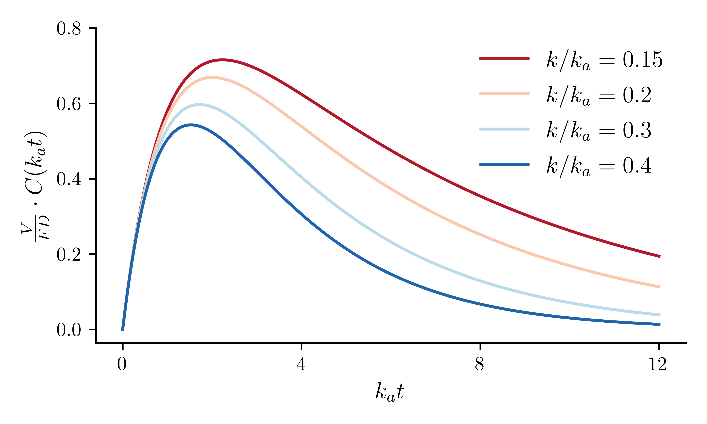{height=33%} -->


### The Model

* Prior distributions derived from a 2019 review on apixaban pharmacokinetics.
* Each patient gets their own parameters through a random effect

$$ y_{j}(t_i) \sim \operatorname{Lognormal}(C_j(t_i), \sigma^2_y) $$
$$C_j(t)= \begin{cases}\frac{F \cdot D}{Cl_{j}} \frac{k_{e, j}\cdot k_{a, j}}{k_{e,j}-k_{a, j}}\left(e^{-k_{a, j}(t-\delta_j)}-e^{-k_{e, j}(t-\delta_j)}\right) & \delta \leq t \\ 0 & \text { else }\end{cases}$$
$$ \log(Cl_j) \sim \mathcal{N}(\mu_{Cl}, \sigma^2_{Cl}) $$$$ \log(t_{\max, j}) \sim \mathcal{N}(\mu_{t_{\max}}, \sigma^2_{t_{\max}}) $$
$$ \alpha_j \sim \operatorname{Beta}(2, 2) $$
$$ \delta_j \sim \operatorname{Beta}(\phi \kappa \>, (1-\phi) \kappa) $$


* Prior distributions on $\mu$, $\sigma^2$, $\phi$, and $\kappa$.

### The Model

* $C(t)$ written in terms of $k_a, k_e$ but model written in terms of $t_{\max}, \alpha$.
* Two equations, two unknowns.

$$ \alpha = \dfrac{k_e}{k_a} \implies k_e = \alpha k_a $$

$$ t_{\max} = \dfrac{\ln(k_e) - \ln(k_a)}{k_e - k_a} \implies k_a = \dfrac{1}{t_{\max}} \dfrac{\ln(\alpha)}{\alpha-1}  $$

### The Model

* Consider $\theta_j = [Cl_j \>, t_{\max, j} \>, \alpha_j]^T$, $\sigma = [\sigma^2_{Cl}, \sigma^2_{t_{\max}}]^T$, and $\mu = [\mu_{Cl} \>, \mu_{t_{\max}} \>]^T$.

<center>

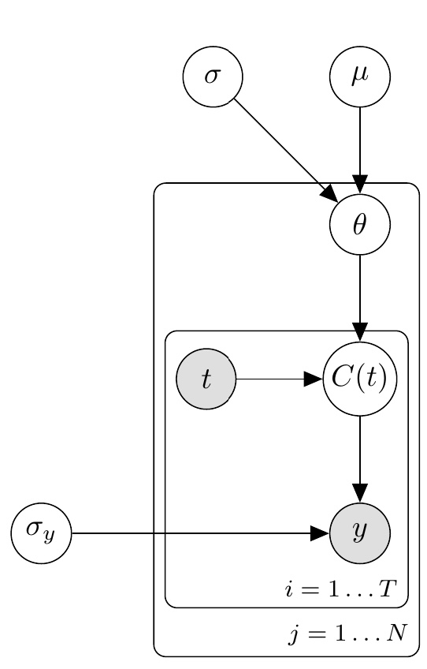{height=80%}

</center>

### Modelling Results 

![[Left] Draws from the prior distribution.  [Center] Two patients from our dataset. [Right] Posterior fits for the latent concentration.](../figures/fig3.png)


### Checking Decision Quality

* Prediction Error

* Decisions under uncertainty
  * Pick a time, $T$ (e.g. $t_{\max}$)
  * Pick a threshold, $c$
  * Pick a desired risk level, $R$.
  * Select a dose so that $P\Big(C(T) > c\Big) = R$

* Approximately $R\times 100$ patients should exceed the threshold.

* Check the calibration of dosing decisions using models fit by MAP and HMC.

### Prediction Error Very Similar

* Prediction error is very similar, no reason to prefer one over the other.

```{r, echo=F, message=F, warning=F}
library(tidyverse)
library(kableExtra)

tribble(
  ~"Loss", ~'HMC', ~"MAP",
  "MSE (Sd)", "6.67 (15.93)", "8.57 (19.93)",
  "MAE (Sd)", "1.71 (1.94)", "1.97 (2.17)",
  "MAPE (Sd)",  "0.04 (0.03)", "0.05 (0.03)"
) %>% 
  kbl(format = 'latex') %>% 
  kable_styling(bootstrap_options = 'striped')
```

### Calibration is Very Different

* HMC very well calibrated, MAP not so much.
* Remember, same model and same priors. Different decisions.
* Why is this happening?

![Calibration on decisions. [Left] Calibration for decision on max concentration.  [Right] Calibration on trough concentration.](../figures/fig8.png){width=80%}

### Uncertainty is Larger in MAP Model

* MAP results in excess uncertainty as compared to HMC.
* Because decisions integrate over uncertainty, differences in uncertainty $\to$ differences in decisions.

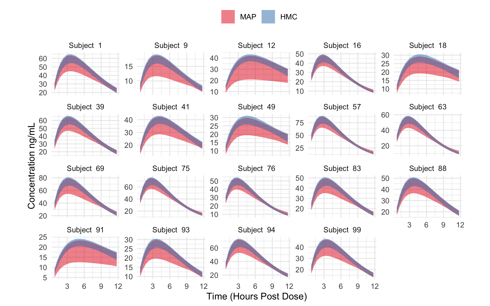{width=95%}

### Discussion

* MAP leads to different decisions than HMC.
* MAP is fast and familiar to MLE, but it is not interchangeable with HMC for these types of models.
* Recommend that if you are to use MAP, invest the time to compare against HMC.

## Paper 2: Developing and Evaulating Pharmacokinetics-Driven Dynamic Personalized Medicine: A Framework and Case Study

### Introduction

* Existing modes of personalization decrease trial-and-error, but do not completely eliminate it.
* Is additional burden on patient and provider (e.g. gathering lab results, additional visits) "worth it"?
* Question of burden is salient:
  * Circumstances for cost effectiveness of PM are unclear [@looff2016economic],[@shabaruddin2015economic].
  * Variability in QALY for some modes of PM [@kasztura2019cost].
  * Need for PM to focus on constraints and utilities of patients to $\uparrow$ adherence and $\downarrow$ adverse events [@rogowski2015concepts],[@di2017personalized].    

### Introduction

* Framework for simulation-based evaluation of static and dynamic personalization based on PK models.
* Generate evidence which can be used in system level decision making.
* Demonstrate framework using data on apixaban.

### Intuitive Idea

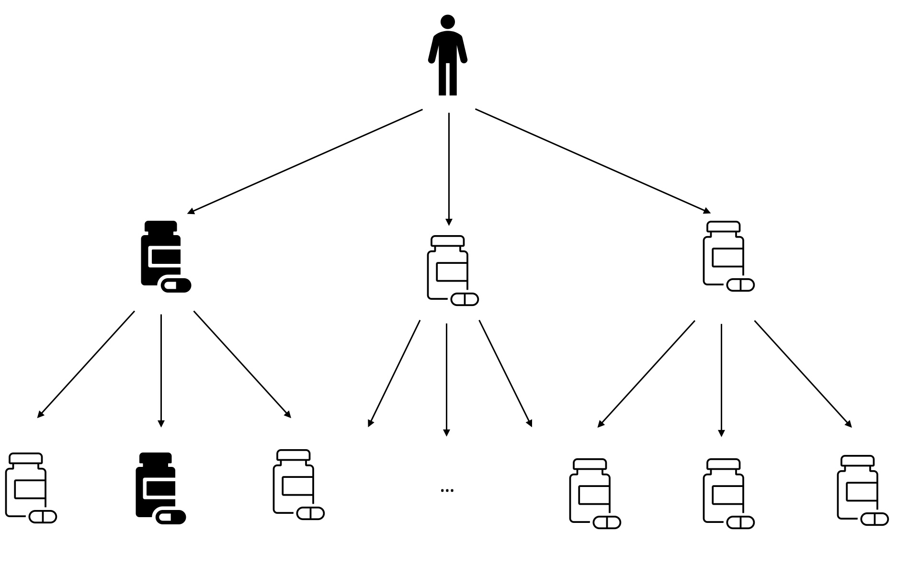

### A Story

Little story to set the stage

* Patient comes in and get's their clinical vars measured 
* Dose is selected based on some decision rule 
* Patient (possibly) returns for a blood measurement 
* Dose is (possible) adjusted
* Goal: "Keep the patient's concentration in a specific range for as long as possible."


### DTRs & Q learning

* To learn from data, need formalism.
* Observe patient in a "stage", $j$.
* A "policy" is a sequence of decision rules $d = (d_1, \dots, d_k)$ each of which takes patient information, ($O_j$) and produces an action, $(A_j)$.
* The "history", $H_j = (O_1, A_1, \dots, O_{j-1}, A_{j-1}, O_j)$.
* Performance of a decision rule is given by "reward", $Y_j$.  The "value", $V_j$, is the expected sum of rewards

$$ V^d_j(h_j)=E_d\left[\sum_{k=j}^K Y_k(H_j, A_k, O_{k+1}) \vert H_j = h_j \right] $$

* A policy is said to be "optimal" if it achieves highest possible value among those under consideration.


### Q learning

* One way to estimate optimal policy, estimate the "Optimal Q function", $Q_j^{\text{opt}}$

$$  Q_j^{\mathsf{opt}}(h_j, a_j) = E \left[ Y_j(h_j, a_j, O_{j+1}) + \max_a Q_{j+1}^{\mathsf{opt}}(H_{j+1}, a) | H_j = h_j, A_j = a_j
 \right] $$
 
* Interpretation: *The value if we took action $a_j$ now and acted optimally thereafter*. 

### Framework

1. Model for PK of drug based on real data
2. Simulate new patients from model
3. Apply personalization to each simulated patient
4. Evaluate "regret" (Maximum possible return - Achieved return).

### Steps 1 and 2: Model & Simulate


* Similar to before, but adjust for covariates and allow for multiple doses

* Similar to last model, but now adjust for patient covariates and allow for multiple doses.

$$\tilde{C}(t) = \sum_{j=0} ^ {20} C(t-12j)H(t-12j)$$

$$C_j(t)= \begin{cases}\frac{F \cdot D_j}{Cl_{j}} \frac{k_{e, j}\cdot k_{a, j}}{k_{e,j}-k_{a, j}}\left(e^{-k_{a, j}(t-\delta_j)}-e^{-k_{e, j}(t-\delta_j)}\right) & \delta \leq t \\ 0 & \text { else }\end{cases}$$


$$ \log(Cl_j) \sim \mathcal{N}\Big(\mu_{Cl,j} + \mathbf{x}^{Cl}_j \beta_{Cl}\>, \sigma^2_{Cl}\Big)$$
$$ \log(t_{\max, j}) \sim \mathcal{N}\Big(\mu_{t_{\max, j}} + \mathbf{x}^{t_{\max}}_j \beta_{t_{\max}} \>, \sigma^2_{t_{\max}} \Big)$$
$$ \operatorname{logit}(\alpha_j) \sim \mathcal{N}\Big(\mu_{\alpha, j} + \mathbf{x}^{\alpha}_j \beta_{\alpha} \>, \sigma^2_{\alpha} \Big)$$


### The Model 

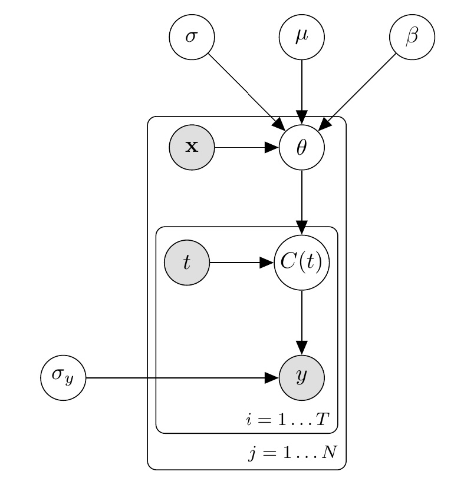{height=80%}

### Step 3: Apply Personalization

* Not intended to be exhaustive, just demonstrative of capabilities:
  * "One Size Fits All" dose
  * "One Size Fits All" dose + 1 dose adjustment (based on measurement of concentration)
  * Dose based on clinical variables
  * Dose based on clinical variables + 1 dose adjustment
  * Optimal Sampling Time (via Q Learning)
  * Optimal Sequential Dosing (via Q Learning)
  
  
### Step 4: Evaluate Regret


* Modes of personalization which use more information result in lower regret
* Point of diminishing returns
* Would expect Q-learning to perform better when elimination rates were very low, meaning impact of decisions last longer.

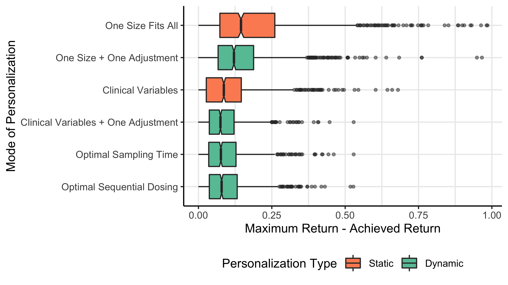


### Conclusions

* In our case study, covariate adjustment seems to do well enough without additional burden.
* If apixaban were eliminated slower, maybe other forms would have improved.
* Better idea of what the impact would be if we implemented a specific mode of personalization.


## Paper 3: Pooling Pharmacokinetic Information Using Hierarchical Models

### Introduction

* Independent PM researchers may be able to collect data from a population of interest.
* Possible questions about new covariates not previously analyzed
* How can researchers use *all* data available to them for inference and discovery?

### Background on Discovery

* Discovery usually means "which variables should go in the model?"
* Many existing studies use variants of stepwise regression [@cirincione2018population],[@ueshima2018population].
* Known deficiencies:
  * Bias *away* from the null [@whittingham2006we], exaggerated precision [@altman1989bootstrap], uninterpretable p-values [@harrell2015regression],       low confidence to select correctly [@smith2018step].


### Background on Inference

* Some studies use linear models to study effects of variables on concentrations [@gulilat2020drug] [@vakkalagadda2016effect].
* Good place to start, but known defficienes:
  * No variation in PK parameters due to covariates, poor approximation when $t \leq t_{\max}$, under determination of effect.
* Mixed effect PK models assume exchangeability of subjects.  Can be violated if not careful when pooling studies.
 
### Contribution

* What is the thing common between :
  * Tightly controlled clinical study
  * Observational data from a personalized medicine clinic.
* Its the dynamics!  Basics of PK works the same for subjects.
* Should be able to translate knowledge across groups.  
* Demonstration of sparsity inducing priors for discovery
  * Application to concomitant medication
  * Simulation study 

### Data

* Data from 2 sources:
  * Repeatedly sampled $\to$ clinical study
  * Sparsely sampled $\to$ PM clinic (observational)

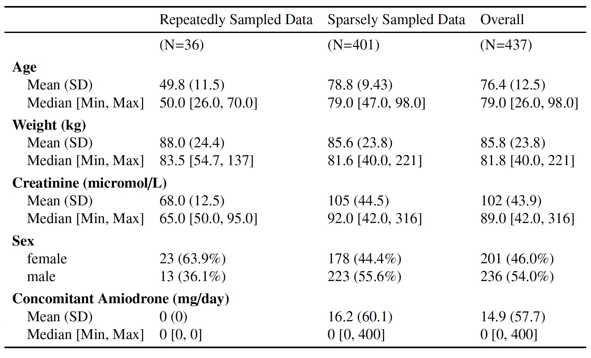

### Combining Data

* "Can't we just stack the data"?
  * No!  Need to consider exchangeability
* *Exchangeability*: $X_1, \dots, X_N$ are exchangeable $\iff$ $P(X_1, \dots, X_N) = P(X_{\sigma(1)}, \dots, X_{\sigma(N)})$.
  * *Conditioned on the covariates, we have no other way of determining which subject belongs to which study*
* Stacking data $\to$ non-exchangeable model
  * Can bias estimates, affect precision, and uncertainty.
  
### Maintaining Exchangeability

* Non-exchangeable because residual variance is larger in sparsely sampled data
  * Mixture of measurement variability and between subject variability
* Simply add a study specific measurement error term

$$ y_{i,j,s} \sim \operatorname{Lognormal}\Big( \log(C_{j, s}(t_i)), \sigma_s \Big)  \>.$$

### The Model


$$ \small C_{j, s}(t_i) =  \begin{cases} c_{0, j, s} + \dfrac{D_{j, s} F_{j, s} k_{e, j, s} k_{a, j, s}}{\mathit{Cl}_{j, s}(k_{e, j, s} - k_{a, j, s})} \Bigg( e^{-k_{a, j, s}(t_i - \delta_{j, s})} - e^{-k_{e, j, s}(t_i - \delta_{j, s})} \Bigg)  & \delta_{j, s} \leq t_i \\ 0 & \mbox{else} \end{cases}$$
\begin{align}
 \log(\mathit{Cl}_{j, s}) &= \mu_{\mathit{Cl}} + \mathbf{x}_{j, s}^{\mathit{Cl}} \beta_{\mathit{Cl}}\\
 \log(t_{\max,j, s}) &= \mu_{t} + \mathbf{x}_{j, s}^{t} \beta_{t} \\
 \operatorname{logit}(\alpha_{j, s}) &= \mu_{\alpha} + \mathbf{x}_{j, s}^\alpha \beta_{\alpha}\\
 \operatorname{logit}(F_{j, s}) &= \mu_{F} + \mathbf{x}_{j, s}^{F} \beta_{F}
\end{align}


 $$c_{0, j, 1} = 0 \quad \forall j$$
 $$\delta_{j, 2} = 0 \quad \forall j$$

### The Model 


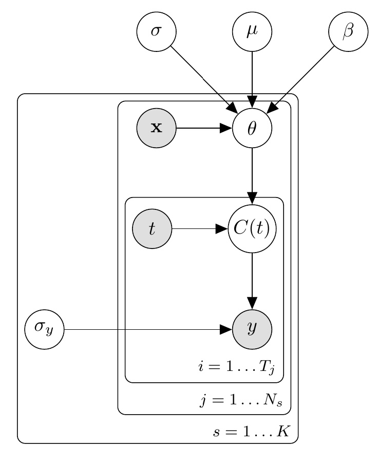{height=80%}

### Simulation Study

* Simulate scenario similar to ours
* $p(\beta_F) =  \operatorname{Laplace}(0, \tau_F)$
* $p(\tau_F) =  \operatorname{Normal}(0, 0.25)$

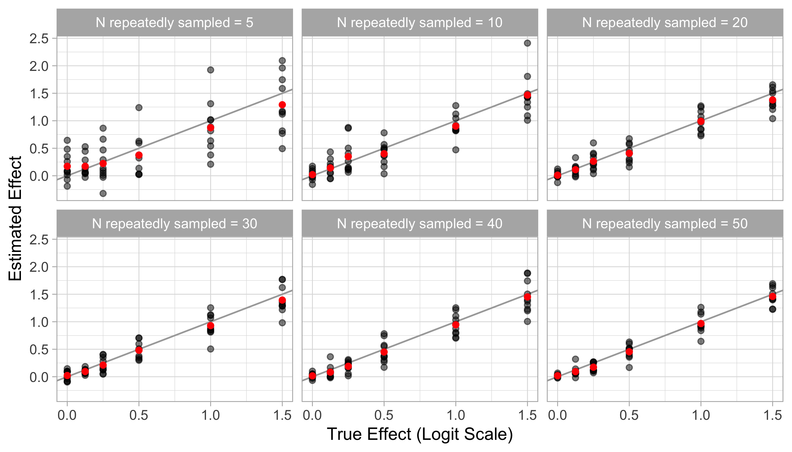

### Results

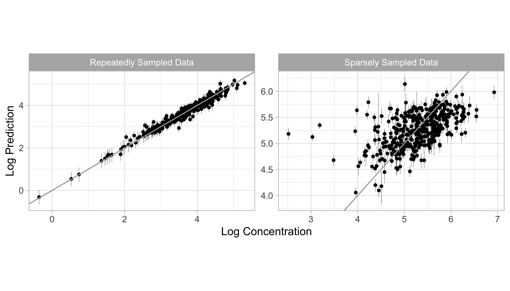

### Results

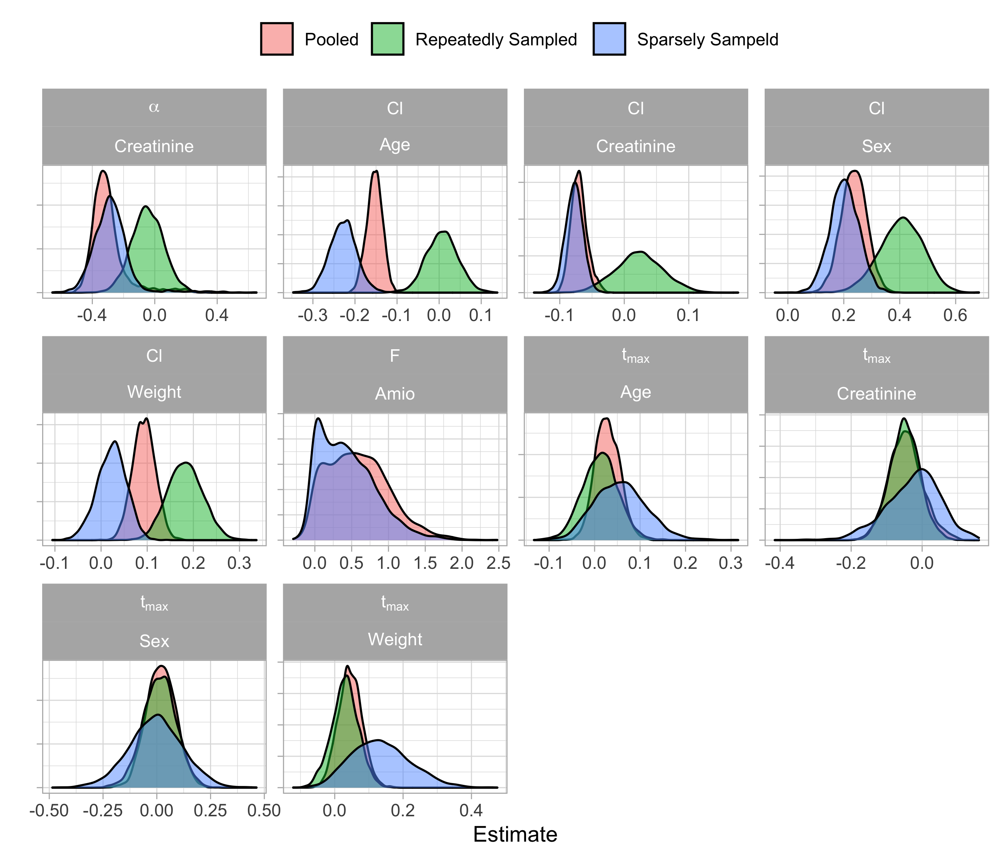{height=80%}

### Discussion &  Conclusion

* Model combines data from different studies, allowing investigators to pool data resources
* Sparse priors used for discovery, exchanging bias for variance
* Estimates of effects consistent with other hierarchical models: regularization towards the null
* Limitation
  * Missing data (e.g. NAFLD)
  * Assumption that time delay was 0 in sparse data.
  * Possible inappropriateness of extrapolation of effect from repeatedly sampled data to sparsely sampled data.
  
  
## Thesis Conclusion

### Discussion

* Goals of this thesis: address factors driving between patient variability in drug response and optimal dose selection
1. HMC leads to better calibrated decisions in PM
2. Framework for combining PK models with DTR for comparison of modes of personalization
3. Pool data by considering what is the same between datasets while also accounting for study specific details.


### Key Themes

* Need to simulate plausible data and evaluate models on intended use.
* Diminishing returns on personalization, need to incorporate patient preferences
* Need for efficient use fo data resources in PM

### Future Work

* PK Model
* Reward function which better reflects reality; inverse reinforcement learning
* Bayesian imputation methods

### References {.allowframebreaks} 


