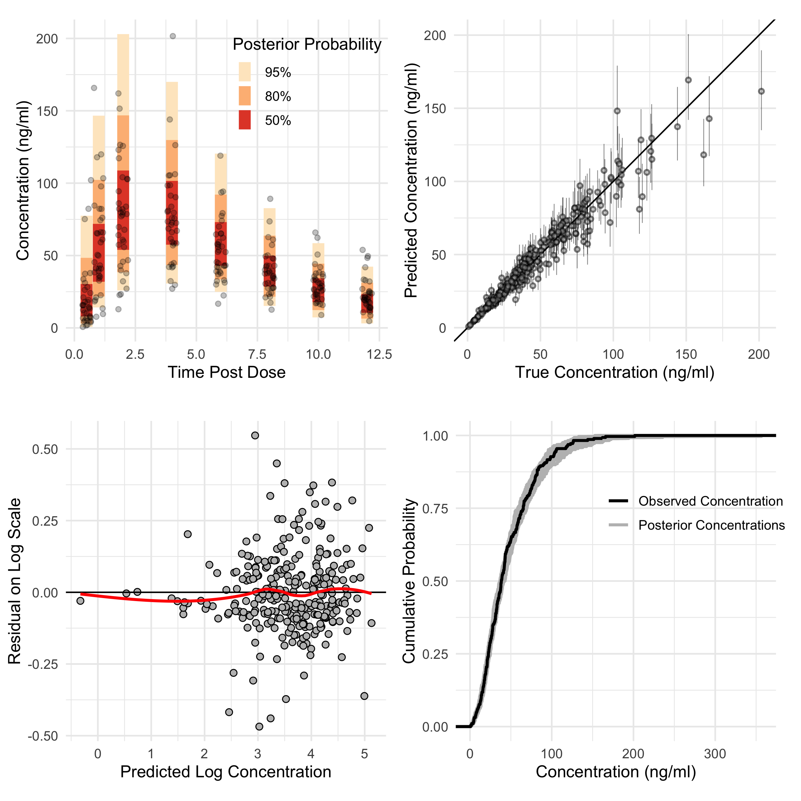

```{r setup, include=FALSE}
knitr::opts_chunk$set(echo = FALSE)
```


### Motivation

* Different people react differently to the same drug, even if they match on important variables. This is can be an obstacle for optimal treatment:

  * Heightened response ($\to$ toxicity)
  * Lowered response ($\to$ inefficacy)
  
* Personalized medicine is a response to this problem.

### Personalized Medicine

*Personalized Medicine (PM)*: Application of genomic, demographic, and lifestyle factors as predictors of disease risk and individualization of drug therapy [@morse2015personalized].

Morse and Kim identify 4 goals of PM:

  1) Identify drugs for which excess variation in response is key issue to treatment
  2) **Identify factors driving this variation**
  3) **"Right amount, drug, right patient, right time"**
  4) Aid in prevention of adverse events associated with said drugs

### Excess Variation Motivates Fine Tuning

* *Pharmacokinetics* (PK): Time course of drug concentrations in the body. 
  * Understand variation in concentration since drug concentration $\leftrightarrow$ drug exposure.
* Many PK studies provide dose adjustment criteria based on modelling
* Excess variation beyond that observed in clinical trials [@sukumar2019apixaban].  Motivates a "fine tuning" to population at hand.

### How to "Fine Tune"

* Bayesian statistics is one possible formalization of "fine tuning" previous modelling.
* PM is about a sequence of decisions (about treatment).  Adopt a formalization of sequential decision making (dynamic treatment regimes (DTR)).
* Decisions in PM are based on concentrations (PK).  Synergy between PK modelling and DTRs.

### This Thesis

* Methods for creating Bayesian PK models for:
  * Inference on covariate effects on concentrations, and
  * Use in optimal sequential decision making on dose size.
  
Hence, this thesis is most closely aligned with goals \textcolor{uwo-purple}{(2) and (3)} of personalized medicine.

### Objectives & Contrubutions

* Compare/contrast existing approaches to fitting Bayesian models with recent advancements in pursuit of fitting population PK models.
  * One compartment model based on non-standard parameterization.  Simulation study demonstrating MAP leads to poorer calibrated decisions.
* Develop a framework for evaluating the benefits of collecting additional information against burden put on patient.
  * Framework for development of simulation-based evaluation of personalization based on PM combined with DTRs.
* Demonstrate how PM researchers in academic centers can use all data available to them to study effects of variables on PK while also exploring new variables.
  * Demonstration of how to combine observational and tightly controlled data. Comments on and reparameterizations to maintain exchangeability.

## Paper 1: Comparisons Between HMC and MAP for a Bayesian Model for Apixiban Induction Dose and Dose Personalization

### Background

* Hamiltonian Monte Carlo (HMC) considered gold standard for sampling from a Bayesian model.  Theoretical understanding came within last 10 years.
* Prior to that, Maximum A Posteriori (MAP) a popular method for fitting Bayesian models.
* Theoretical arguments *against* using in some models, mostly based on differential geometric arguments.
* Question:
  * Are decisions in PM greatly affected by choice of inference method?
  * Answer: Predictions of concentration are similar, but uncertainty is different.  This affects decision quality.
  
### Motivating Theory

* Intuition for MAP is based on low dimensional thinking.
* Theory for HMC says MAP should break down as number of parameters in the model increases.
* For some PK models, number parameters might scale like $3N$.
* Might effect estimates of concentration, might effect uncertainty estimates too.

### Experiments

* Need a ground truth that looks similar to real data.
* Fit a model using HMC to real data and use posterior predictive to generate 100 new simulated patients.
* Refit the model on this simulated data, this time with MAP and HMC. 
* Compare decision quality based on two criteria:
  * Pick a dose so the maximum concentration is not too large (toxicity)
  * Pick a dose so the trough concentration is not too small (inefficacy)


### The Model

* 1 Compartment PK model with first order elimination and absorption.
* Prior distributions derived from a 2019 review on apixaban pharmacokinetics.
* Each patient gets their own parameters through a random effect
$$y(t)= \begin{cases}\frac{F \cdot D}{C l} \frac{k_e \cdot k_a}{k_e-k_a}\left(e^{-k_a(t-\delta)}-e^{-k_e(t-\delta)}\right) & \delta \leq t \\ 0 & \text { else }\end{cases}$$


### Modelling Results 

![[Left] Draws from the prior distribution.  [Center] Two patients from our dataset. [Right] Posterior fits for the latent concentration.](../figures/fig3.png)

### How Does It Fit?

{width=80%}

### Checking Decision Quality

* Decide on a risk threshold, $C$.
* Use model(s) to determine the dose, $D$, such that $P(y(T)>C) = R$.
* If every patient is given this dose, then $R \times 100$ patients should exceed threshold.
* Determine a sort of "calibration" for decision

### Checking Decision Quality

![[Left] Calibration for dosing to avoid excessively large max concentration. [Right] Calibration for dosing to avoid excessively low trough concentration.](../figures/fig8.png)


### References